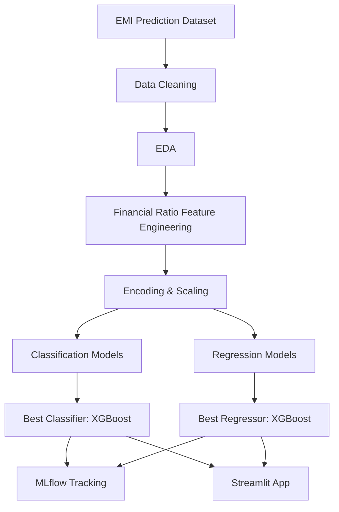

<div align="center">

# 💳 EMIPredict AI: Loan Eligibility & Safe EMI Prediction System


**🔗 Live App:** [emi-predict-ai-app.streamlit.app](https://las9n5jdkanafvs2q38ick.streamlit.app/)

> An end-to-end Machine Learning project that predicts a loan applicant's **EMI eligibility** and their **maximum safe monthly EMI**, helping financial institutions make faster, more consistent, and data-driven lending decisions.

</div>

---

# Project Overview

EMIPredict AI is a financial risk assessment platform built on 404,800 loan-applicant records. The project performs:

* **EMI Eligibility Classification** — predicts whether an applicant is `Eligible`, `High_Risk`, or `Not_Eligible`
* **Maximum Safe EMI Regression** — estimates the largest monthly EMI an applicant can safely sustain
* **Interactive Deployment** through a multi-page Streamlit application

The system enables loan officers and fintech platforms to screen applicants consistently, quantify affordability numerically, and avoid over-lending to high-risk profiles.

---

## Key Highlights

* End-to-end supervised ML workflow — classification and regression
* 404,800 loan applications analyzed
* 42 engineered features after preprocessing
* 4 candidate models trained and compared per task
* XGBoost selected as the final production model for both tasks
* 97.0% classification accuracy, R² of 0.99 on EMI regression
* MLflow experiment tracking across all model runs
* 4-page interactive Streamlit application
* Model persistence using Joblib

---

## Business Problem Statement

Lenders evaluating EMI (loan installment) applications face recurring challenges:

* Inconsistent manual eligibility decisions across officers
* Difficulty quantifying "how much EMI can this applicant actually afford"
* Risk of approving applicants who are likely to default
* Slow, non-scalable manual underwriting for high application volumes
* No systematic way to translate income, expenses, and credit history into a lending decision

This project addresses these challenges with a trained classifier for eligibility screening and a trained regressor for affordability estimation, both deployed behind a single interface.

---

## Objectives

### Eligibility Classification

* Analyze applicant income, expenses, credit, and loan-request data
* Engineer affordability and debt-burden ratios
* Classify applicants into `Eligible`, `High_Risk`, `Not_Eligible`
* Flag high-risk applicants before disbursal

### Safe EMI Estimation

* Build a regression model for maximum sustainable monthly EMI
* Compare the model's recommended EMI against the applicant's requested amount
* Support affordability-based loan structuring rather than flat approval/rejection

---

# Table of Contents

* [Live Demo](#live-demo)
* [Project Overview](#project-overview)
* [Dataset Information](#dataset-information)
* [Project Architecture](#project-architecture)
* [Technology Stack](#technology-stack)
* [Exploratory Data Analysis](#exploratory-data-analysis)
* [Data Preprocessing](#data-preprocessing)
* [Feature Engineering](#feature-engineering)
* [Model Development](#model-development)
* [Hyperparameter Tuning](#hyperparameter-tuning)
* [Results & Performance](#results--performance)
* [Model Comparison](#model-comparison)
* [Applicant Risk Segments](#applicant-risk-segments)
* [Business Impact](#business-impact)
* [Challenges Faced](#challenges-faced)
* [Future Improvements](#future-improvements)
* [Installation Guide](#installation-guide)
* [Usage](#usage)
* [Project Structure](#project-structure)
* [Reproducibility](#reproducibility)
* [Key Learnings](#key-learnings)
* [Acknowledgements](#acknowledgements)

---

# Live Demo

The Streamlit application is deployed and publicly accessible here:

**🔗 [https://emi-predict-ai-app.streamlit.app](https://emi-predict-ai-app.streamlit.app/)**

Use it to try both modules directly in the browser, no local setup required:

* **Eligibility Prediction** — enter an applicant's income, expense, and credit details to get an eligibility decision with full class-probability breakdown
* **EMI Calculator** — get the maximum safe monthly EMI estimate for that applicant, compared against their requested EMI

> Note: Streamlit Community Cloud apps sleep after periods of inactivity. If the link shows a "waking up" screen, wait a few seconds and it will load normally.

---

# Dataset Information

## Dataset Source

**EMI Prediction Dataset**

* Domain: Consumer Lending & Financial Risk Analytics
* Applicant-level loan request records
* Income, expense, and credit history fields
* Requested loan terms per applicant

---

## Dataset Statistics

| Metric              | Value                                 |
| -------------------- | -------------------------------------- |
| Total Records         | 404,800                                |
| Raw Features           | 27                                      |
| Features After Engineering | 42                                  |
| Dataset Type           | Applicant-level, tabular                |
| Domain                 | Consumer Lending                        |
| Analysis Type           | Supervised Learning (Classification + Regression) |

---

## Features Description

| Feature                | Description                                  |
| ------------------------ | ---------------------------------------------- |
| age                        | Applicant's age                                  |
| gender                     | Applicant's gender                               |
| marital_status              | Married / Single                                  |
| education                   | Highest education level                            |
| monthly_salary               | Applicant's monthly income                          |
| employment_type               | Salaried / Self-employed / Private, etc.               |
| years_of_employment              | Years in current employment                             |
| company_type                       | Type of employer                                          |
| house_type                           | Owned / Rented                                              |
| monthly_rent                           | Monthly rent paid, if applicable                              |
| dependents                                | Number of financial dependents                                  |
| school_fees / college_fees                   | Education-related monthly expenses                                 |
| travel_expenses                                | Monthly travel spend                                                  |
| groceries_utilities                               | Monthly groceries and utility bills                                      |
| other_monthly_expenses                               | Remaining miscellaneous monthly spend                                       |
| existing_loans                                          | Whether the applicant already has active loans                                 |
| current_emi_amount                                         | EMI currently being paid, if any                                                  |
| credit_score                                                  | Applicant's credit score (300–850)                                                   |
| bank_balance                                                     | Current bank balance                                                                     |
| emergency_fund                                                      | Savings set aside for emergencies                                                          |
| emi_scenario                                                           | Purpose of the requested loan                                                                  |
| requested_amount                                                          | Loan amount requested                                                                              |
| requested_tenure                                                             | Requested repayment tenure, in months                                                                  |

---

## Target Variables

This is a **dual-target supervised learning project**:

* `emi_eligibility` — classification target (`Eligible`, `High_Risk`, `Not_Eligible`)
* `max_monthly_emi` — regression target (maximum sustainable monthly EMI, in ₹)

---

# Project Architecture

## End-to-End Workflow

```text
Raw Applicant Data
       │
       ▼
Data Cleaning
       │
       ▼
EDA
       │
       ▼
Financial Ratio Feature Engineering
       │
       ▼
Feature Scaling & Encoding
       │
       ▼
Classification + Regression Models
       │
       ▼
Model Selection (Best of 4 per task)
       │
       ▼
MLflow Tracking
       │
       ▼
Streamlit Deployment
```

---

## System Architecture



---

# Technology Stack

| Category               | Technologies                                    |
| ------------------------ | -------------------------------------------------- |
| Programming Language        | Python                                                |
| Data Processing                | Pandas, NumPy                                            |
| Visualization                     | Matplotlib, Seaborn                                          |
| Machine Learning                     | Scikit-Learn, XGBoost                                            |
| Classification Models                   | Logistic Regression, Decision Tree, Random Forest, XGBoost           |
| Regression Models                          | Linear Regression, Decision Tree, Random Forest, XGBoost                 |
| Experiment Tracking                           | MLflow                                                                      |
| Scaling                                          | StandardScaler                                                                |
| Model Serialization                                 | Joblib                                                                          |
| Deployment                                             | Streamlit                                                                         |
| Notebook Environment                                      | Jupyter Notebook                                                                     |

---

# Exploratory Data Analysis

## Key Insights

### Applicant Analysis

* Corrupted numeric strings and inconsistent gender labels were present in raw fields and required targeted cleaning.
* Out-of-range credit scores (outside the valid 300–850 band) were found and treated as missing.
* Missingness across key columns was confirmed to be at random before imputing.

### Financial Behavior Analysis

* Debt-to-income and EMI-to-income ratios showed the strongest relationship with eligibility outcomes.
* Disposable income and affordability ratio were highly predictive of both eligibility and safe EMI capacity.
* `family_size` and `dependents` were found to be near-perfectly collinear; `family_size` was dropped to avoid redundant signal.

### Target Distribution

* Eligibility classes are imbalanced — `Not_Eligible` is the majority class, `High_Risk` the minority — handled via class-weighting during training.
* `max_monthly_emi` is right-skewed, consistent with a small share of high-income applicants requesting large EMIs.

---

## Important Visualizations

* Eligibility Class Distribution
* Maximum EMI Distribution
* Correlation Heatmap
* Confusion Matrix (per classifier)
* Feature Importance (per model)
* Actual vs Predicted EMI (per regressor)
* Classifier & Regressor Comparison Charts

---

# Data Preprocessing

## Data Quality Fixes

| Issue                          | Action                          |
| --------------------------------- | ---------------------------------- |
| Corrupted numeric strings (age, salary, bank balance) | Cleaned via regex and re-cast to numeric |
| Inconsistent gender labels             | Standardized to `Male` / `Female`      |
| Out-of-range credit scores                | Set to missing, then imputed              |
| Missing `education`                          | Imputed with mode                            |
| Missing `monthly_rent`                          | Imputed with median, grouped by `house_type`   |
| Missing `credit_score`, `bank_balance`, `emergency_fund` | Imputed with column median |

---

## Redundant Feature Removal

| Column        | Reason                                    | Action  |
| --------------- | -------------------------------------------- | ------- |
| `family_size`     | Near-perfect collinearity with `dependents` | Dropped |

---

## Feature Engineering

### Engineered Financial Ratios

| Feature                     | Formula                                                       |
| ------------------------------ | ------------------------------------------------------------------ |
| total_monthly_expenses            | Sum of rent, fees, groceries, travel, and other monthly costs           |
| debt_to_income_ratio                 | current_emi_amount ÷ monthly_salary                                        |
| expense_to_income_ratio                 | total_monthly_expenses ÷ monthly_salary                                       |
| disposable_income                          | monthly_salary − total_monthly_expenses − current_emi_amount                     |
| affordability_ratio                           | disposable_income ÷ monthly_salary                                                  |
| proposed_installment                             | requested_amount ÷ requested_tenure                                                    |
| emi_to_income_ratio                                 | proposed_installment ÷ monthly_salary                                                     |
| emergency_fund_months                                  | emergency_fund ÷ total_monthly_expenses                                                      |
| liquidity_ratio                                           | bank_balance ÷ total_monthly_expenses                                                           |
| credit_score_band                                            | Binned credit score (`Poor` → `Excellent`)                                                        |

---

## Encoding Techniques

| Type                   | Method                                    |
| ------------------------- | -------------------------------------------- |
| Binary categoricals (gender, marital_status, existing_loans) | Label-mapped to 0/1 |
| Ordinal categoricals (education, credit_score_band)          | Ordinal-encoded      |
| Nominal categoricals (employment_type, company_type, house_type, emi_scenario) | One-hot encoded |

---

## Scaling Method

**StandardScaler**

Reasons:

* Required for the distance/gradient-sensitive Logistic Regression and Linear Regression baselines
* Ensures fair feature contribution across differently-scaled financial fields
* Applied consistently at inference time via the saved scaler artifact

---

# Model Development

## Classification Models

### 1. Logistic Regression

Linear baseline with class-balanced weighting; establishes a reference point for the tree-based models.

### 2. Decision Tree

Single-tree classifier tuned via `GridSearchCV`; interpretable but prone to overfitting at high depth.

### 3. Random Forest

Bagged ensemble of decision trees; reduces variance relative to a single tree.

### 4. XGBoost — **Final Model**

Gradient-boosted ensemble, tuned via `RandomizedSearchCV` with sample-weighted class balancing. Outperformed all other candidates on every classification metric.

---

## Regression Models

### 1. Linear Regression

Baseline regressor for maximum monthly EMI.

### 2. Decision Tree Regressor

Tuned via `GridSearchCV`.

### 3. Random Forest Regressor

Tuned via `GridSearchCV`, subsampled for training efficiency.

### 4. XGBoost Regressor — **Final Model**

Tuned via `RandomizedSearchCV`. Outperformed all other candidates on every regression metric.

---

# Hyperparameter Tuning

## Search Strategy

* `GridSearchCV` for Logistic Regression, Decision Tree, and Random Forest
* `RandomizedSearchCV` for XGBoost (classifier and regressor)
* Model selection based on test-set macro-F1 (classification) and RMSE (regression)

---

## Tuned Parameters

| Model                | Parameters                                              |
| ----------------------- | ------------------------------------------------------------ |
| Logistic Regression         | C                                                                |
| Decision Tree                  | max_depth, min_samples_leaf                                        |
| Random Forest                     | n_estimators, max_depth                                              |
| XGBoost                              | n_estimators, max_depth, learning_rate, subsample                       |

---

## Best Configuration

| Parameter             | Value                    |
| ------------------------ | ---------------------------- |
| Final Classifier            | XGBoost                        |
| Final Regressor                | XGBoost                          |
| Train / Val / Test Split          | 70% / 15% / 15%                   |
| Random State                         | 42                                  |

---

# Results & Performance

## Classification Performance (Test Set)

| Metric             | Score  |
| --------------------- | ------ |
| Accuracy                 | 97.0%   |
| Precision (macro)           | 0.865    |
| Recall (macro)                 | 0.949      |
| F1-score (macro)                  | 0.897        |
| ROC-AUC (OVR)                        | 0.997          |

---

## Regression Performance (Test Set)

| Metric        | Score      |
| ---------------- | ---------- |
| RMSE                | ₹625         |
| MAE                    | ₹229           |
| R² Score                  | 0.9935          |

---

# Model Comparison

## Classifiers

| Rank | Model                | Accuracy | F1 (macro) | Notes              |
| ---- | ----------------------- | -------- | ---------- | ------------------- |
| 🥇 1  | XGBoost                    | 97.0%      | 0.897         | Final Model            |
| 🥈 2  | Decision Tree                  | 93.3%      | 0.800         | Strong Alternative        |
| 🥉 3  | Random Forest                      | 92.3%      | 0.793         | Comparable to Decision Tree |
| 4    | Logistic Regression                    | 81.9%      | 0.669         | Linear Baseline              |

## Regressors

| Rank | Model                | RMSE   | R²    | Notes              |
| ---- | ----------------------- | ------ | ----- | ------------------- |
| 🥇 1  | XGBoost                    | ₹625     | 0.994   | Final Model            |
| 🥈 2  | Random Forest                  | ₹1,086   | 0.980   | Strong Alternative        |
| 🥉 3  | Decision Tree                      | ₹1,155   | 0.978   | Comparable to Random Forest |
| 4    | Linear Regression                      | ₹4,100   | 0.720   | Linear Baseline              |

---

# Applicant Risk Segments

| Segment      | Characteristics                                             |
| -------------- | -------------------------------------------------------------- |
| Eligible          | Healthy affordability ratio, low existing debt burden, strong credit |
| High_Risk            | Marginal affordability or elevated debt-to-income ratio                  |
| Not_Eligible             | Insufficient disposable income relative to requested EMI                    |

---

# Business Impact

## Practical Applications

* Automated first-pass eligibility screening
* Affordability-based EMI structuring instead of flat approve/reject
* Early flagging of high-risk applicants before disbursal
* Consistent, auditable lending decisions across loan officers
* Faster turnaround on high application volumes

---

## ROI Implications

* Reduced default risk through affordability-aware EMI recommendations
* Faster loan processing and reduced manual underwriting cost
* More consistent risk assessment across applications
* Better-informed loan structuring, improving repayment rates

---

## Industry Use Cases

* Consumer Lending & NBFCs
* Digital Lending Platforms / Fintech
* Banking Loan Origination Systems
* Buy-Now-Pay-Later (BNPL) Risk Screening

---

# Challenges Faced

## Technical Challenges

* Large applicant volume (404,800 rows) requiring efficient preprocessing
* Class imbalance in eligibility labels
* Selecting the best model fairly across four very different algorithm families
* Keeping regression and classification pipelines consistent for shared inference

---

## Data Challenges

* Corrupted numeric strings in raw source columns
* Inconsistent categorical labeling (gender variants)
* Out-of-range and missing credit scores
* Collinear features (`family_size` vs `dependents`)

---

## Solutions Implemented

* Regex-based numeric string repair
* Domain-valid range checks for credit score
* Median/mode imputation grouped by relevant categorical context
* Collinearity check via correlation heatmap prior to modeling
* Class-weighted / sample-weighted training across all classifiers
* Multi-model, multi-metric comparison before final selection

---

## Deployment Roadmap

* Docker containerization
* CI/CD pipeline
* Cloud deployment
* REST API for programmatic access
* Monitoring dashboard for live prediction quality

---

# Installation Guide

> Prefer not to install anything? Try the live app instead: [emi-predict-ai-app.streamlit.app](https://emi-predict-ai-app.streamlit.app/)

```bash
git clone <repository-url>

cd EMI-Predict-AI

pip install -r requirements.txt
```

---

# Usage

## Run Notebook

```bash
jupyter notebook
```

Open:

```text
notebooks/EMIPredict_AI_Model_Development.ipynb
```

---

## Run Streamlit Application

```bash
streamlit run Home.py
```

---

## Application Modules

### Eligibility Prediction

Input:

* Applicant demographic, income, expense, and credit details
* Requested loan amount and tenure

Output:

* Predicted class — `Eligible`, `High_Risk`, or `Not_Eligible`
* Full class probability breakdown

---

### EMI Calculator

Input:

* Same applicant details as above

Output:

* Maximum safe monthly EMI estimate
* Comparison against the requested EMI amount

---

### Model Performance

Output:

* Classifier and regressor test-set metrics
* Confusion matrix, feature importance, and actual-vs-predicted charts
* Full 4-model comparison for both tasks

---

### Data Insights

Output:

* Dataset-level statistics and distributions
* Eligibility and EMI trend charts from the training data

---

# Project Structure

```text
EMI-Predict-AI/
│
├── data/
│   └── emi_prediction_dataset.csv
│
├── notebooks/
│   ├── EMIPredict_AI_Model_Development.ipynb
│   └── images/
│
├── models/
│   ├── final_classifier.joblib
│   ├── final_regressor.joblib
│   ├── scaler.joblib
│   ├── label_encoder.joblib
│   └── feature_names.joblib
│
├── pages/
│   ├── 1_Eligibility_Prediction.py
│   ├── 2_EMI_Calculator.py
│   ├── 3_Model_Performance.py
│   └── 4_Data_Insights.py
│
├── utils/
│   ├── model_loader.py
│   ├── form_inputs.py
│   └── preprocessing.py
│
├── assets/
│   └── *.png
│
├── Home.py
├── requirements.txt
└── README.md
```

---

# Reproducibility

1. Clone repository
2. Install dependencies
3. Place dataset inside `data/`
4. Execute the notebook sequentially
5. Generate engineered financial-ratio features
6. Train and compare all four classification and regression models
7. Save the best-performing model artifacts (`models/*.joblib`)
8. Launch the Streamlit application

Random Seed:

```python
random_state = 42
```

---

# Key Learnings

* Financial ratio feature engineering for credit risk modeling
* Multi-model comparison across classification and regression tasks
* Class-imbalance handling via sample weighting
* Boosting vs. bagging vs. single-tree trade-offs on tabular financial data
* MLflow-based experiment tracking
* Streamlit deployment for a dual-task ML application
* Keeping model documentation, notebook outputs, and deployed metrics in sync

---

# Author

**Sita Bharatula**

[](https://www.linkedin.com/in/sita280603)
[](https://github.com/maha2806)
[](mailto:bhsita18@gmail.com)

---

# Acknowledgements

* Scikit-Learn
* XGBoost
* MLflow
* Streamlit
* Pandas
* NumPy
* Matplotlib & Seaborn
* Open Source Community

---

<div align="center">

*If this project was useful, a ⭐ on the repository is appreciated.*

</div>
